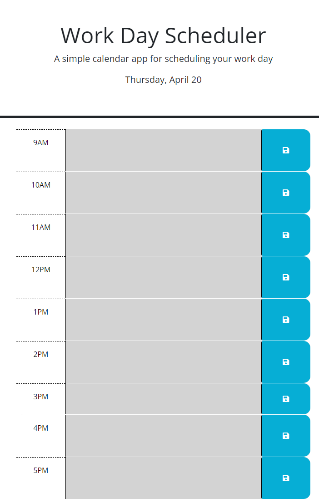

# The-Perfect-Planner-4-20-23
## Description

This website was created to give people the ability to have a daily planner that categorizes tasks by the hour. It will update the date and time of the tasks dynamically by using day.js. It will save the tasks to local storage so that they will still appear if the page is refreshed. It is a somewhat simple planner but should be useful for helping plan out the upcoming day and keep people on task with the continuously updating time.
## Website Screenshot 

## URL of Deployed Link

https://dmschopler.github.io/The-Perfect-Planner-4-20-23/